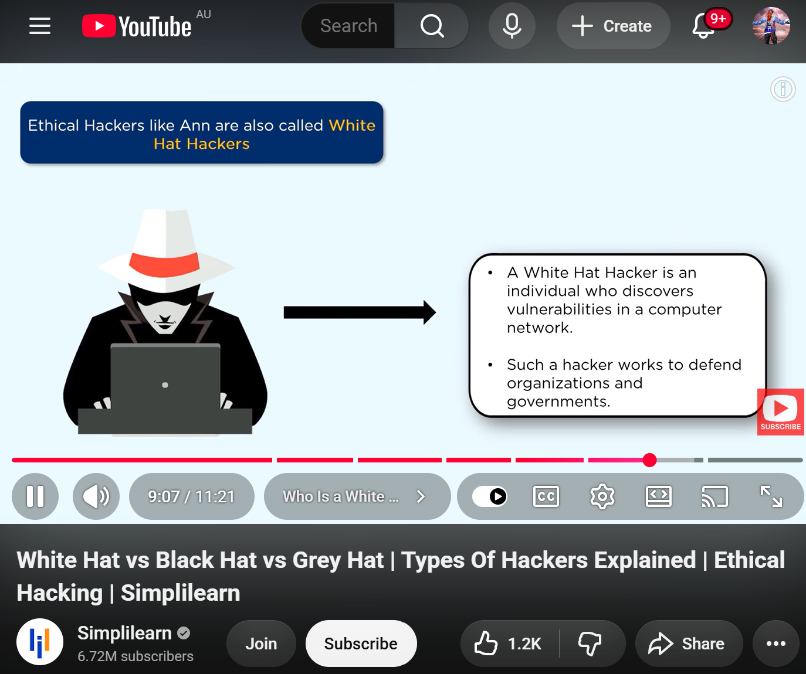
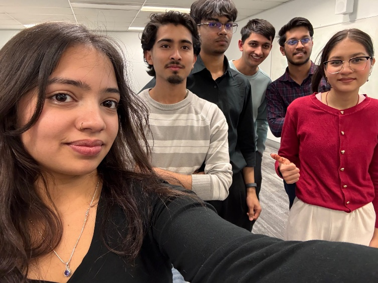

# e-portfolio 2. Ethics in ICT

## Artefact 1: Types of Hackers Video

[White Hat vs Black Hat vs Grey Hat, Types Of Hackers Explained, Ethical Hacking, Simplilearn, YouTube](https://www.youtube.com/watch?v=9K8Xn0y5CU4)

### 1. Describe

This film demonstrates the ethics of hacking while highlighting three hacker categories. White hat hackers look for and inform about vulnerabilities with the consent of the relevant companies via bug bounty programs offered by companies like Microsoft and Google. Black hat hackers apply vulnerabilities illegally for self-benefit or to cause havoc. Grey hat hackers search for and report vulnerabilities without getting the approval beforehand but without malicious intent, which brings about many ethical and legal dilemmas.

### 2. Analyse

Before viewing this video, I knew that hackers could have different motives, but I had no proper understanding of the distinction between white hat, black hat and grey hat hackers. The video clarified the essential aspect of ethical hacking, which does not merely consist of technical knowledge but also entails compliance with rules and ethical conduct. This connects very well to the Kantian ethical theory studied in the workshop because white hat hackers respect rules while black hat ones disregard moral obligations to gain personal benefits. I chose this artefact because it greatly affected my understanding of hacking and raised awareness about the importance of ethics in cybersecurity.

### 3. Evaluate

In conclusion, this training has made me learn a lot of things. One key learning point has been that a good cybersecurity professional should have some level of ethics related to the industry and respect laws as well as the regulations set forth by organisations. In relation to my profession in ICT, I believe that I must get proper authorisation for any software procedural testing and follow the proper disclosure process when identifying weaknesses.

## Artefact 2: FreeHour Ethical Hacking Case, Malta, News Article

[Ethical hackers charged with unauthorised access to FreeHour app, Newsbook.com.mt, 2025](https://newsbook.com.mt/en/ethical-hackers-charged-with-unauthorised-access-to-freehour-app/)

### 1. Describe

In 2022, three students of computer science at the University of Malta and their teacher discovered critical security flaws in FreeHour, which is the most popular timetable app for students in Malta. Instead of taking advantage of the vulnerability, they reported the issue to the founder of FreeHour and asked for a bug bounty, a normal procedure in ethical hacking. FreeHour, in turn, reported them to the police. The students were taken into custody, stripped and had their devices seized. In 2025, all four were prosecuted under the Computer Misuse Act of Malta and could face incarceration for up to four years.

### 2. Analyse

I found this instance to be troublesome because of my concern that those who tried to responsibly report a security flaw were instead met with punishment. Initially, my instinct was to think that their actions were benign and not meant to do harm. Upon doing some research on social contract theory, I discovered that both parties – the organisation and the researchers – have duties of their own. Researchers have the duty to act responsibly, while the organisation must develop fair policies that ease responsible reporting instead of making it difficult.

### 3. Evaluate

This was a mixed learning experience as the students' behaviour may have been ethical, but there were significant legal implications.  I learned that professionals in the field of ICT must learn about both ethical duties and legal obligations prior to performing security testing. Accordingly, going forward, I will always make sure to have proper authorisation in addition to following responsible disclosure protocols and observing both rules of ethics for professionals and the law.

## Artefact 3: Privileged User Training, Video Series

[Privileged User Training, Australian Cyber Security Centre (ACSC)](https://www.cyber.gov.au/business-government/protecting-devices-systems/system-administration/privileged-user-training)

### 1. Describe

The ACSC has compiled this training series for privileged ICT personnel, like system administrators and network security professionals, who have privileged access to systems and data. The materials focus on attacker behaviour, defence-in-depth strategies, risk management, and incident response, and some of the new challenges like social engineering and AI threats are also discussed. The release date of the content was July 2026 in order to fulfil the annual cybersecurity training obligation of the Australian Government for those privileged users.

### 2. Analyse

I find this series interesting since it views privileged users as unique threats, not because they usually cause something bad to happen, but because any mistake they make can potentially cause greater harm than an average user can do. Until I came across this information, I used to regard cybersecurity education simply as well-meaning advice given to staff. But now that I realise privileged access means even more rigorous and necessary training, I understand better why that is necessary. This connects to the idea of virtue ethics because people in such jobs have to be honest, responsible, and trustworthy not just at the hiring stage but later as well, which is why they are supposed to undergo training on an annual basis.

### 3. Evaluate

In conclusion, this turned out to be a fruitful learning experience for me since it allowed me to revise my views on cybersecurity risks. I got to know that the protection of information often presupposes the establishment of an atmosphere of trust and accountability rather than relying solely on numerous technical means of protection. As a future ICT specialist, I would behave responsibly and regularly update my security knowledge and manage my privileges accordingly.

## Artefact 4: Workshop Personal Reflection

| Workshop Week | Day and Date | Tutor | Campus |
|---|---|---|---|
| Week 4 | Thursday, 6 August 2026 | Mr Umapathy Venugopal | Sydney |

### 1. Describe

In this week's workshop, ethics and theories of ethics were covered in connection with ICT and society. The contents included definitions of morality, ethics, and law and five theories of ethics—namely Kantianism, act and rule utilitarianism, social contract theory and virtue ethics. Each theory was used in discussions of a particular example of ethical conduct: the early release of a buggy application, claiming authorship of AI-generated results, directing traffic on the highway, prevention of computer worms, and profiting from customer information in business.

### 2. Analyse

The AI assignment situation caught my attention as AI tools are prevalent in education, and it is hard to distinguish between using AI to help you or relying on it for completing the task assigned to you. Before the workshop, I used to believe that the only requirement for using AI was that the final response should look correct. After learning more about Kantianism, I understood that it is wrong to claim AI-produced work as your own because this involves dishonesty and disregards the concept of integrity in science. Kantian ethics suggests that people should act according to moral obligations and duties instead of being overly motivated by the results.

### 3. Evaluate

In general, this was an advantageous learning experience because it has allowed me to know more about the application of ethical theories to real situations related to ICT. I have learned that only technical knowledge is insufficient and that ICT specialists should be honest and responsible and consider how their decisions influence others. Furthermore, I will use AI in the future as a learning tool but take care to present my own knowledge when turning in my assignments without compromising academic integrity. Moreover, this workshop prompted me to reflect on the ethical implications of my actions in my future profession in ICT.

## References in CQU Harvard Style

Simplilearn 2021, White Hat vs Black Hat vs Grey Hat, Types Of Hackers Explained, Ethical Hacking, video, 6 June 2021, viewed 6 August 2026, <https://www.youtube.com/watch?v=9K8Xn0y5CU4>

Newsbook.com.mt 2025, Ethical hackers charged with unauthorised access to FreeHour app, Newsbook, viewed 6 August 2026, <https://newsbook.com.mt/en/ethical-hackers-charged-with-unauthorised-access-to-freehour-app/>

Cybersecurity and Infrastructure Security Agency CISA 2019, Understanding the Insider Threat, video, 29 March 2019, viewed 6 August 2026, <https://www.youtube.com/watch?v=5GLNKHJCSkg>
