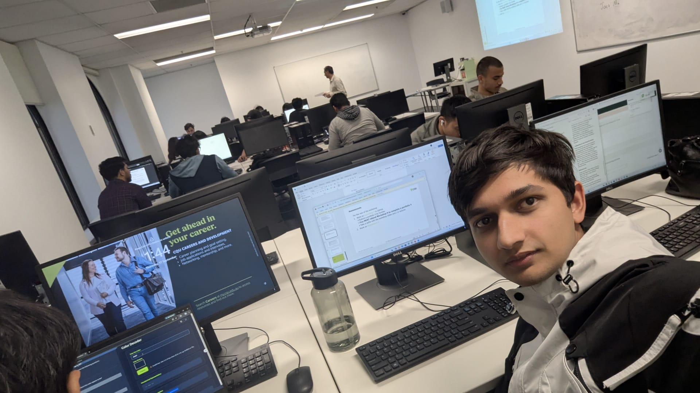

**E-PORTFOLIO 4**

**Censorship and Government**

Unit: COIT11223 - ICT Ethics and Governance in Society

*Week 9: Censorship and Government*

Name: Abishek Sapkota

Student ID: 12312491

Campus: CQUniversity Sydney

Lecturer: Umapathy Venugopal

Date: 10 September 2026

# e-Portfolio 4: Censorship and Government

This e-portfolio was created in connection with my studies in Information and Communications Technology to examine the subject of censorship and government regulation of the internet, which is one of the topics raised in Week 9 of the course. It consists of a video news report, a news story, an article from a peer-reviewed journal, and my reflection on the activity on the topic of censorship, which was done during the Week 9 practice. The e-portfolio illustrates how much I have learned about the role of different players, including governments, courts, and private businesses, in defining what is acceptable for people to do online. One needs to remember the principles behind this process, which call for protection of every individual against harm without infringement of their freedom, which can be illustrated by the case of a 2025 ban on social media similar to arguments presented by Kant and Mill against censorship long ago.

## Artefact 1: Australia's Social Media Ban for Under-16s Takes Effect in World First

Source: [FRANCE 24, YouTube, 9 December 2025](https://www.youtube.com/watch?v=WLVNnEyX_BU)

### Summary of the Artefact

This FRANCE 24 (2025) video report tells the story of the implementation of the world-first ban on social media accounts for under-16-year-olds in Australia, effective from midnight on December 10, 2025. The report mentions that ten major platforms (such as Facebook, Instagram, TikTok, and YouTube) were under an obligation to prevent Australian user accounts of people under 16 years of age from creating accounts. If they did not comply, they would be at risk of facing fines of up to 49.5 million Australian dollars. Hundreds of thousands of youth social media users are expected to be affected by this new implementation, including around 350,000 Instagram users aged 13 years old to 15 years old. The report addresses the idea of the law as a deliberate action of the government targeting to take control of the situation from large tech companies, while the law was considered a scandalous one due to its controversial nature by the tech companies as well as free speech advocates, but highly welcomed by numerous child-safety organisations and many concerned parents.

### Justification on Why I Chose the Artefact

I opted for this video because it is indeed a groundbreaking example of a government that is distinguishing between protecting society and curbing personal freedom, which is the purpose of this e-portfolio. One of the reasons behind the ban I heard about in the workshop was the growing concern about social media addiction among young people, which is linked to public health and falls within the harm-prevention paradigm alongside safety from predators and harmful content. Analysing the announcement made the situation more tangible for me, as now the policy holds true for hundreds of thousands of children rather than just the theoretical aspect of the matter. It also relates to Mill's Principle of Harm discussed at the workshop, as the policy speaks about harm prevention instead of restricting an opinion.

## Artefact 2: Nepal Lifts Social Media Ban After Deadly Protests

Source: [The Kathmandu Post 2025, 'Nepal's Gen Z uprising explained', 8 September](https://kathmandupost.com/national/2025/09/08/nepal-s-gen-z-uprising-explained)

### Summary of the Artefact

According to The Kathmandu Post (2025), an English-language publication in Nepal, the imposition of a ban was based on the Directives for Managing the Use of Social Networks 2023, which listed Meta, Google, and X among companies that should register with the Ministry of Communication and Information Technology within a timeframe of a week. Since they failed to fulfill their obligations, 26 companies stopped functioning by midnight. The newspaper also claims the protests are intrinsically linked to the "Nepo Kid" movement, which emerged as a viral social media campaign that alleged politicians' children lead luxurious lives while impoverished youth are jobless. The same publication, however, notices that the protestors relied on social VPN applications that are banned by the law to take advantage of the situation. In the opinion of Nepali analysts, the protests turn on the issue of who controls information in a democracy, rather than simply the problem of not having access to Facebook.

### Justification on Why I Chose the Artefact

The reason why I opted for this article is the fact that it was not just a case study for me, as a Nepali national, but it also unfolded in my native country. Social media is the main source of information for a great number of young Nepalis, including myself, as well as through family connections, so the ban seemed very close to me. The manner in which the initial anger over the restriction turned into a political outburst in the form of protests against corruption, nepotism and the lack of accountability illuminated to me the true significance of the government's censorship justification. Unlike in Australia, where the usage of a child-safety justification was broadly accepted, everybody I know in Nepal perceived the ban as another method of political manipulation.

## Artefact 3: Potential Effects of the Social Media Age Ban in Australia for Children Younger Than 16 Years

Source: [Fardouly, J 2025, The Lancet Digital Health, vol. 7, no. 4, pp. e235–e236](https://www.sciencedirect.com/science/article/pii/S258975002500024X)

### Summary of the Artefact

This peer-reviewed commentary article, written by Fardouly (2025), a psychologist from the University of Sydney and published in The Lancet Digital Health (open access), gives a critical opinion about possible consequences of an under-16 ban on social media in Australia. Her opinion suggests that banning might cut down children's chances of experiencing cyberbullying, online solicitation and inappropriate content regarding eating disorders, but it should be noticed that similar threats exist on non-banned platforms, including games and YouTube. Moreover, she warns that similar bans that were set in practice in China, South Korea and France tend to fail, as children always find ways to circumvent such bans, and that the age verification technology poses its own privacy issues. Fardouly concludes that it is an obligation of the state to control some media, and yet the ban will not help to solve the issue unless combined with a duty of care for the media.

### Justification on Why I Chose the Artefact

This article was selected for the reason that, unlike the news articles being reviewed in the other sources, it comes from an academic peer-reviewed source that weighs the merits and also the disadvantages of the ban. The article reminded me of the things about censorship, how it can be an admirable idea but may not work as efficiently if one has his/her heart in the right place. Also, it supports the main point of the workshop, since Fardouly herself states that although regulation is necessary, it is not sufficient if there is no transparency and obligation of care.

## Artefact 4: Workshop Personal Reflection

| Field | Detail |
|---|---|
| **Workshop** | Week 9: Censorship and Government |
| **Day / Date** | Thursday, 10 September 2026 |
| **Tutor** | Umapathy Venugopal |
| **Campus** | Sydney |

### Attendance Evidence

Selfie taken during the Week 9 workshop, confirming physical attendance.

### Summary of the Artefact: My Personal Reflection

The focus of this week's workshop was on internet censorship in Australia from various perspectives, including legal, ethical and technical. We talked about the various ways in which the government blocks online platforms, such as DNS and firewall-based blocking, Section 313 of the Telecommunications Act and the 2013 case of ASIC, where IP-based blocking mistakenly prohibited about 250,000 unrelated websites. The case of 2024 eSafety Commissioner v X was also discussed, highlighting the restricted scope of Australia's authority when it comes to global platforms, as the Federal Court concluded that X can be ordered to geo-block the content in Australia, not take it down globally. The role of the Australian Classification Board in the process of rating movies, games, and other publications was also examined. When seen from the Kantian point of view, censorship should respect individual freedom and dignity. The Act Utilitarianism theory views the issue from the perspective of making sure censorship produces more benefits than negative outcomes. Ultimately, we had some discussion regarding the clashes between digital platforms and traditional classification systems and why censorship should not require some extreme restrictions on freedom.

### Justification on Why I Chose the Artefact

What I found interesting was that it seems an important ethical principle was common across the various methods of censorship in Australia I examined: it is necessary to protect individuals from harmful actions without infringing upon personal freedom. The ASIC event forced me to rethink the way in which I view the government's censorship by demonstrating that, despite a person's good intentions, censorship can be as negative as it can hurt people unintentionally. The experience from the eSafety v X case also interested me since it showed me that the government authorities are controlled and restrained, and it is not possible for them to go too far, even if they intend to protect the masses from a certain danger. Putting my thoughts into perspective now, I realise that an ICT professional must assess any censorship issue from three perspectives: what type of harm is being controlled through censorship, how proportional the censorship is used to prevent this harm and whether there is an independent institution like a court able to analyse and revoke the censorship actions if it is judged to be inappropriate.

## References

The Kathmandu Post 2025, 'Nepal's Gen Z uprising explained', 8 September, viewed 17 September 2026, <https://kathmandupost.com/national/2025/09/08/nepal-s-gen-z-uprising-explained>

eSafety Commissioner v X Corp [2024] FCA 499.

Fardouly, J 2025, 'Potential effects of the social media age ban in Australia for children younger than 16 years', The Lancet Digital Health, vol. 7, no. 4, pp. e235-e236, viewed 17 September 2026, <https://doi.org/10.1016/j.landig.2025.01.016>

FRANCE 24 2025, 'Australia's social media ban for under-16s takes effect in world first', YouTube, 9 December, viewed 17 September 2026, <https://www.youtube.com/watch?v=WLVNnEyX_BU>

Quinn, MJ 2020, Ethics for the Information Age, 8th edn, Pearson, United States.
